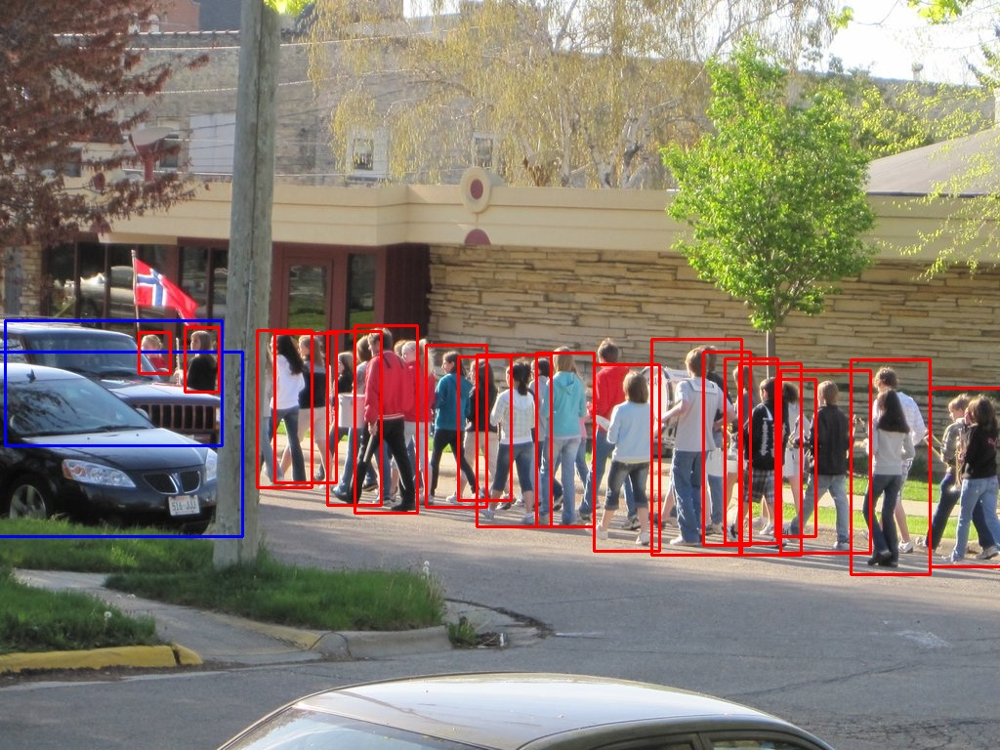
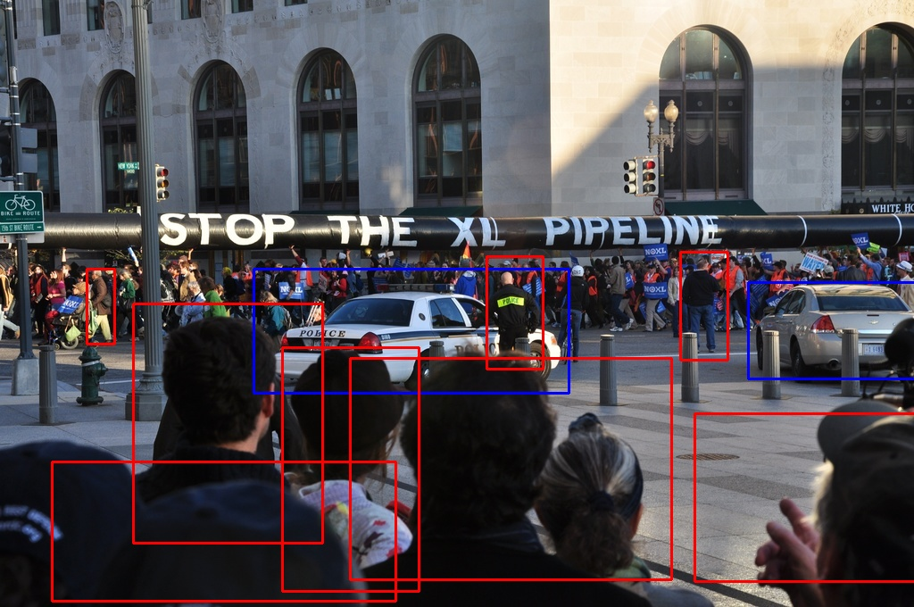

### Summary of the Object Detection Model

* Model name: YoloV4 - Darknet framework. 
* You can find Dataset here: https://drive.google.com/file/d/1sVPCa38Xg7bgaG7KU62gjHXcAwJFrFTw/view?usp=sharing, Framework: https://github.com/AlexeyAB/darknet, you can find the weights here: https://drive.google.com/file/d/11FH8qWNvu0C2EXgHkztBr3p3rHyws99D/view?usp=sharing. 
* YoloV4 had to be build on your system from source to use this model. You can check here https://github.com/AlexeyAB/darknet#how-to-compile-on-linuxmacos-using-cmake. 
* Once darknet is build, we can work on that repository, to create a annotations required fro Yolo training you can run **"python yoloformat.py"**
* Yolo is one stage detector, YOLOV4 Model is updated version of V3 with some new training techniques like **Cross-iteration Batch Normalisation etc.. & new Activation Mish**. 
* This architecture also uses new Data Augmentation techniques like **Mosaic & Self Adversarial Training**. All these tricks made V4 **fast & more accurate** compared to other architectures.
* **Primary Analysis:** After making the data ready for Yolov4 training along with annotations, i have took 10% of data separately and kept it for validation while training. 
* **Assumptions:** Data we have is properly annotated with ground truths & have enough samples per class for training & testing.
* Initially went with default anchors provided by YoloV4, later to **improve MAP calculated the anchors based on my dataset** & retrained and had a significant improvement in mAP. 
* **Metrics:** mAP (mean Average Precision) improved a lot after using custom Anchors. 
* **Inference:** While checking on images, noticed a lot of falses of people because in an image we can only see half of there body, legs or upper body. We don't have Ground truth for that, but model learned to detect to those also. 
* I tested the model on the test set which i kept out. False positives & misses are mainly in crowded places. Ground truths on the test images has people annotated in the background with little to no clarity of that people.
* **Conclusion:** With more data according to our needs, like ignoring people in the background with no clear visibility & removing people or cars barely visible can improve the model. This can make the model focus on complete object, instead of parts of it. 
* **Recommendation:** After testing & have watched some testing images, i thought More data will definitely help and RetinaNet framework would have helped in detecting Densely covered objects like the cases with lot of people. 

**Yolo Training**

* I have trained on the dataset with width & height at **608*608 and also used mosaic augmentation** which combines four images into one with annotations to generalise better. 
* You can find the cfg file with all the configurations set in the file "yolov4-objnew.cfg".
* Like i said after training with Default Anchors, i calculated custom anchors for my dataset & trained again. You can find the anchors to in file "yolov4-objnew.cfg".
* Initially i used pretrained model provided, to get better results **"./darknet detector train data/obj.data yolov4-objnew.cfg yolov4.conv.137"**
* You can check the mAP in between to see the performance **"./darknet detector map data/obj.data yolov4-objnew.cfg backup\yolov4-objnew_2000.weights"**.
* You can find here different ways to check the model on Image, Set of Images, Video etc.. **"https://github.com/AlexeyAB/darknet#how-to-use-on-the-command-line"**

 

**Inference Results:**

* You can find the inference on some of the test images. Red bounding box is the Person & blue is Car.
* 
* Ground truths has a lot more annotations for people on the background. 

* 